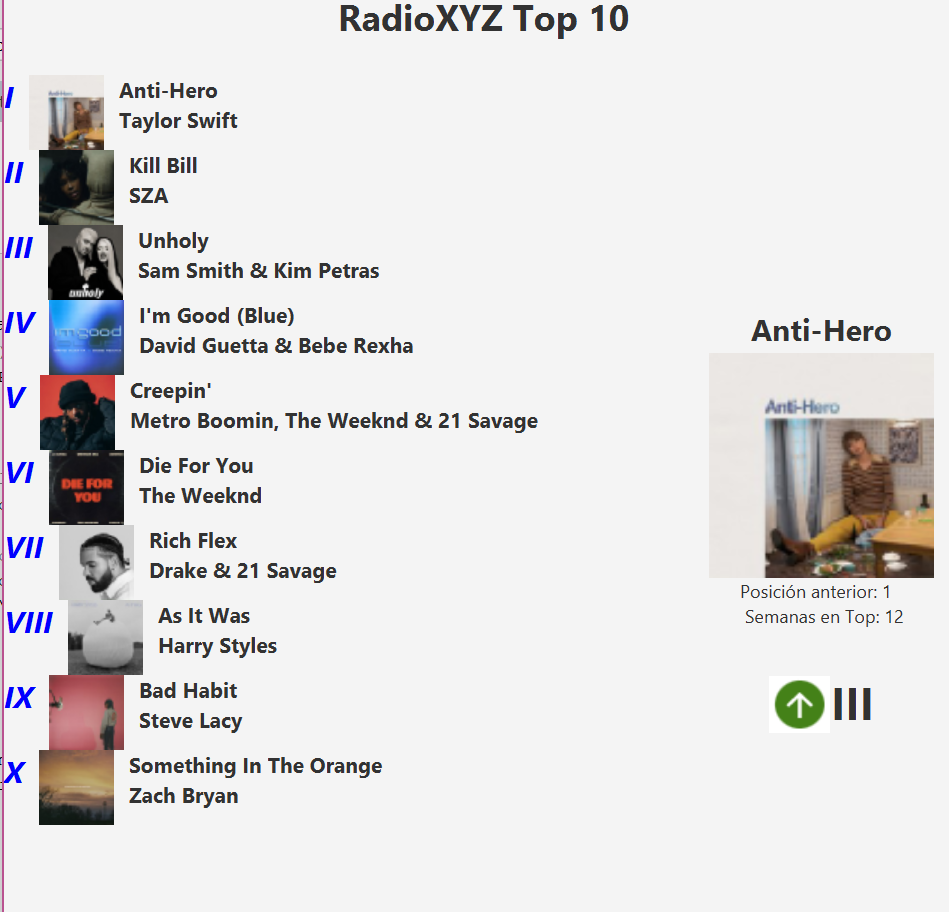

# Taller01-Ramas

### Integrante 2 - Juan Fernandez

Se cambió el orden de las 10 canciones principales en forma descendiente, usando estos comandos:

En `PrimaryController.java, linea 34:`

`Collections.sort(listaCanciones, Collections.reverseOrder());`

Captura:

Integrante 4 - Dhamar Quishpe 

Se cambió los números por números romanos y se añadió color. 

Captura de pantalla 
 

