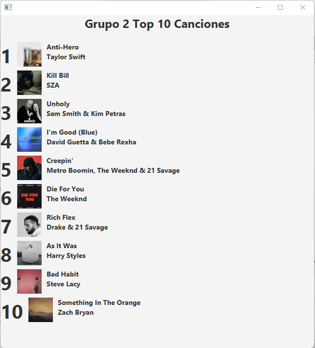

# Taller01-Ramas

### Lider - Randy Rivera

Se cambio el titulo a "Grupo 2 Top 10 Canciones"

En `primary.fxml, linea 40`

`<Label text="Grupo 2 Top 10 Canciones" BorderPane.alignment="CENTER">`

Captura: 




### Integrante 2 - Juan Fernandez
Se cambió el orden de las 10 canciones principales en forma descendiente, usando estos comandos:

En `PrimaryController.java, linea 33:`

`Collections.sort(listaCanciones, Collections.reverseOrder());`

Captura:


### Integrante 3 - Andrés Salazar
Se colocó el nombre del artista o grupo antes del nombre de la canción.

En `PrimaryController.java, linea 47:`

`Label lbT = new Label(c.getCantante() + " \n" + c.getTitulo() );//cantante y titulo`

Captura:


### Integrante 4 - Dhamar Quishpe 

Se cambió los números tradicionales por números romanos y se añadió color.

En `PrimaryController.java, linea 37`

`Label lbp = new Label(aRomano(c.getPosActual()) + "");`

En `PrimaryController.java, linea 58-92`

```
public String aRomano(int num){
        if (num==1){
            return "I";
        }
        if (num==2){
            return "II";
        }
        if (num==3){
            return "III";
        }
        if (num==4){
            return "IV";
        }
        if (num==5){
            return "V";
        }
        if (num==6){
            return "VI";
        }
        if (num==7){
            return "VII";
        }
        if (num==8){
            return "VIII";
        }
        if(num==9){
            return "IX";
        }
        if (num==10){
            return "X";
        }
        else{
            return "No se pudo convertir a número romano";
        }
    }
    
```

En `PrimaryController.java, linea 130`

`Label lbP = new Label(aRomano(p) + "");`


Captura:

 
