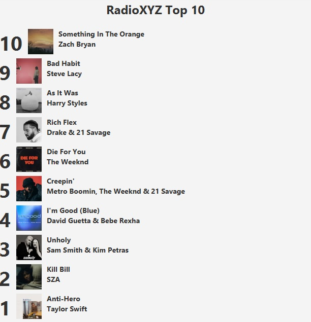
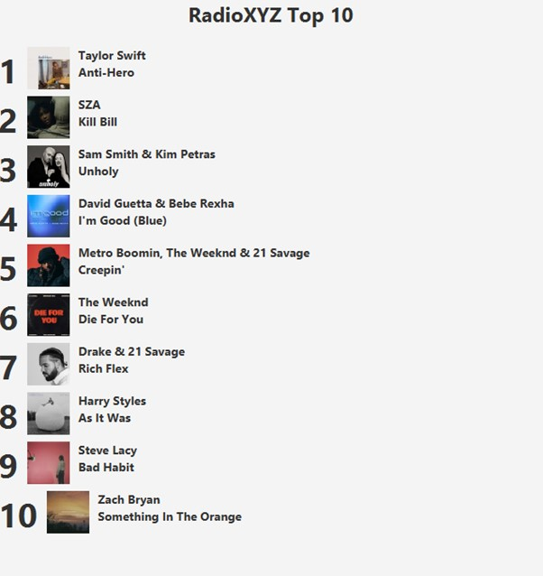

# Taller01-Ramas

### Lider - Randy Rivera
Captura: 

Se cambio el titulo a "Grupo 2 Top 10 Canciones"

En `primary.fxml, linea 40`

`<Label text="Grupo 2 Top 10 Canciones" BorderPane.alignment="CENTER">`

### Integrante 2 - Juan Fernandez
Se cambió el orden de las 10 canciones principales en forma descendiente, usando estos comandos:

En `PrimaryController.java, linea 34:`

`Collections.sort(listaCanciones, Collections.reverseOrder());`

Captura:

### Integrante 3 - Andrés Salazar
Se colocó el nombre del artista o grupo antes del nombre de la canción.

En `PrimaryController.java, linea 48:`

`Label lbT = new Label(c.getCantante() + " \n" + c.getTitulo() );//cantante y titulo`

Captura:

